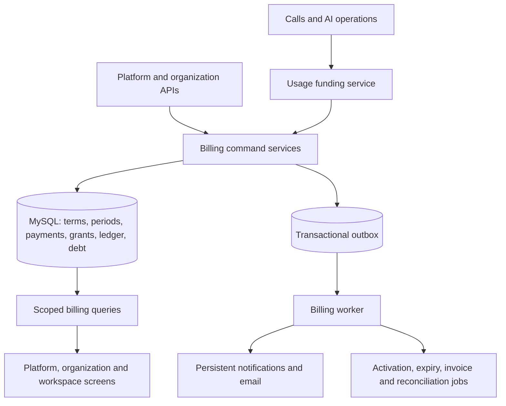

# Organization billing and workspace funding architecture

Status: proposed architecture for review; no runtime changes in this document delivery.
Date: 2026-10-08. Applies to crm-backend-test and com-frontend-test.

## 1. Product contract

- The organization owns funds, subscriptions, invoices and debt. Admin is an
  authority over the organization pool, never the financial owner.
- Subscription grants expire at their exact paid period end. Top-up grants have
  no expiry. Both first land in the unallocated organization account.
- Org admins distribute grants manually or through saved rules. Workspaces spend
  only their own allocations. Transfers preserve grant identity and validity.
- Fallback is an organization setting: prepaid top-up or postpaid. Subscription
  credits are consumed first in either mode. Postpaid requires explicit workspace
  authorization with a limited or unlimited workspace allowance.
- Subscription price, included credits, extra workspace fees, industry fees and
  taxes are separate terms. Paying a fee does not implicitly mint usage credits.
- Platform admins manage plans, entitlements, payment decisions and organization
  overrides. Org admins manage allocations, permitted postpaid limits and contacts.
- Payment confirmation is manual initially. Future gateway verification invokes
  the same financial commands, rather than a second accounting implementation.

## 2. Architecture decision

Use a modular billing domain with ports and adapters in the existing Node
application and MySQL database. Business rules depend on contracts, not Express,
MySQL, telephony providers, SMTP or the scheduler. Compose adapters once at startup.
MySQL is the financial source of truth; transactional outbox jobs provide durable
asynchronous work. Keep the financial write boundary together initially; scale
workers, integrations and queries independently before extracting services.



### Existing integration gaps confirmed in source

| Current location | Required integration |
| --- | --- |
| src/crm/rechargeBilling.js | Replace direct wallet mutations with funding commands; preserve legacy adapter during rollout. Current settlement clamps overspend and appends ledger after commit. |
| src/crm/billingEngine.js | Stop rolling periods forward on reads for migrated orgs; use persisted periods. |
| src/billing/billingPeriod.js | Replace calendar-month authority with persisted subscription/postpaid cycle resolution. |
| src/billing/callBillingService.js | Keep pricing breakdown; make charge revisions idempotent instead of treating a mutable report as financial truth. |
| src/telephony/callFinalizer.js | Post-call AI finishes asynchronously; emit durable priced usage revisions and settle deltas. |
| src/telephony/vobiz/vobizProxy.js | Authorize, extend, release and finalize reservations through the same service. Audit other providers and inbound paths before enforcement. |
| src/ai/geminiUsageTracker.js | Preserve historical pricing snapshots and emit durable finalized usage events. |
| src/billing/billingConsole.js | Read grants, allocations, exposure and invoices; retain existing report compatibility. |
| src/workspaces/organizationPolicy.js | Import existing policy as initial entitlement/price terms; avoid two independent policy authorities after migration. |
| src/email/mailer.js | Distinguish delivered/submitted from unconfigured/skipped/failed; a skipped email is not successful delivery. |
| src/scheduler/runner.js | Its running guard is process-local; financial jobs require DB claims and idempotency across replicas. |
| Frontend src/App.tsx and NotificationBell.tsx | Current notifications live in component state; financial notifications need persisted events and per-recipient read state. |
| Frontend src/components/DialerSimulator.tsx | Replace org-wallet client gate with workspace funding availability; backend remains authoritative. |

## 3. Boundaries and modules

Organize by business capability, with explicit public entrypoints:

```text
src/billing/
  contracts/                 # Versioned command, event and read DTO schemas
  kernel/                    # Amount, period, IDs, invariant/error types only
  modules/
    catalog/                 # Plan versions, quotes and entitlements
    subscriptions/           # Purchased terms and period lifecycle
    payments/                # Confirmation and fulfillment
    credits/                 # Grants, positions and financial journals
    allocations/             # Rules, previews and transfers
    funding/                 # Usage authorization and settlement orchestration
    postpaid/                # Exposure, receivables and invoices
    notifications/           # Recipient policy, threshold state and deliveries
  application/               # Cross-capability use cases and transaction ownership
  ports/                     # Persistence, clock and external integration contracts
  adapters/
    mysql/                   # Repositories, unit of work, claims and outbox
    http/                    # Authenticated routes and transport validation
    legacy/                  # Existing wallet and billing compatibility
    payments/                # Manual verification; future gateway adapters
    usage/                   # Telephony, AI and future service adapters
    delivery/                # SMTP and persistent in-app feed
    jobs/                    # Existing scheduler trigger / worker entrypoints
  composition.js             # Concrete dependency wiring
```

Modules own their tables and expose commands/queries; do not export mutable ORM
entities or permit arbitrary cross-module SQL. Cross-capability use cases live in
application/ and own a shared financial transaction. Repositories accept that
transaction through a UnitOfWork port. Avoid one service class that owns all billing.
Services accept explicit orgId, workspaceId, actor and operationId; never accept a
client-provided platformAdmin boolean as authorization. Enforce allowed module
dependencies with static import rules when implementation starts.

- Plan service: immutable published versions and effective-dated org terms.
- Subscription service: periods, scheduled renewal, activation and entitlement resolution.
- Payment service: submissions, decisions, reversals and fulfillment.
- Credit service: grant issuance, transfers, reservations, consumption and expiry.
- Allocation service: preview, versioned rules and one run per incoming grant.
- Funding service: shared usage authorization across credit and postpaid sources.
- Postpaid service: exposure limits, debt, invoice close and payment application.
- Notification service: durable events, recipients, thresholds and delivery state.

Use dedicated repositories with explicit transactions for financial writes.
Do not route them through generic db.create/db.patch helpers or workspace-default
scope inference. Shared organization records must remain accessible to authorized
org admins when switching workspaces, without exposing them to workspace-only users.

### 3.1 Reusable domain concepts

Separate how credits were purchased from how they behave. A grant has a funding
category, validity, eligible service set and consumption priority. Subscription
and top-up are product presets over this model, not hardcoded branches throughout
the application. A future promotion can use the same grant machinery only after
its funding/accounting rules are deliberately implemented.

Use a typed amount {asset, units, scale}; monetary currency and credit asset are
explicit even though the first release has a fixed INR conversion. A funding line
records the conversion/version used. Never add different assets or currencies,
and never implement implicit exchange. Multi-currency remains unsupported until
separate currency accounts, rate policy and reconciliation are supplied.

Use BillingScope {orgId, ownerType, ownerId}, initially organization or workspace.
An owner resolver validates real organizations/workspaces and ownership; this is
not a free-form scope string. Department/project accounts can later add a resolver
without rewriting grants or ledger transfers. Initial APIs still accept only the
approved workspace scope; do not weaken workspace isolation for extensibility.

Separate reusable credit primitives from product policy:

| Primitive | Product policy applied above it |
| --- | --- |
| Issue, reserve, consume, release, transfer, expire | Which payment/period can issue which grant |
| Effective-dated period | Monthly plan or no-subscription postpaid anniversary |
| Funding chain | Subscription -> top-up or subscription -> postpaid |
| Limit and exposure evaluation | Workspace cycle cap, org cycle cap, outstanding debt |
| Allocation calculation | Fixed/percentage rules and suspended-workspace handling |
| Threshold crossing | Credit, postpaid, expiry and renewal notifications |

### 3.2 Extension ports and contracts

These are conceptual signatures; implementations must define validated DTOs and
typed result/error codes before business logic. No dependency injection framework
is required: use explicit factory arguments and small interfaces.

| Port / policy | Contract and boundary |
| --- | --- |
| PaymentVerifier | normalizeVerifiedPayment(providerEvidence) -> confirmed payment with source/event identity; manual adapter receives an authorized review decision, gateway adapter verifies authenticity first. |
| UsageAdapter | authorize/extend/release usage operations and emit immutable measured events; provider-specific call stopping remains in the provider adapter. |
| RatingPolicy | rate(measuredEvent, purchasedRateSnapshot) -> priced components; pure deterministic arithmetic, never reads today's prices during replay. |
| EntitlementPolicy | evaluate(scope, purchasedTerms, requestedCapability, inventoryVersion) -> allowed/reason; same policy for branch creation and service access. |
| FundingPlanner | plan(usageEstimate, validPositions, exposure, policySnapshot) -> ordered reservation lines or typed denial; pure, writes nothing. |
| FundingSource | supports/plan/reserve/settle/release for grant or postpaid positions; mutation methods participate in the caller's UnitOfWork, never call gateways. |
| AllocationPolicy | preview(grant, rules, eligibleOwners) -> exact lines plus remainder or validation error; deterministic and versioned. |
| CalendarPolicy | resolveNextPeriod(anchor, timezone, interval, previousEnd) -> explicit boundaries; pure with supplied clock/timezone data. |
| UnitOfWork | runFinancial(orgId, operationId, expectedVersions, callback) -> committed result; owns locks, journals, outbox, retry policy and rollback. |
| Clock / ID source | Explicit now()/newId(); deterministic in verification and replay. |
| OutboxStore / JobClaimer | append within transaction, claim with fencing token, acknowledge/retry; transport-neutral event envelope. |
| NotificationChannel | deliver(message, stableDeliveryId) -> accepted/skipped/retryable/permanent_failure; SMTP is one adapter. |
| BillingReadStore | Cursor queries over scoped projections; never authorizes financial writes. |

Payment verification, payment acceptance and grant issuance are different steps.
External evidence cannot choose arbitrary credit amounts; fulfillment resolves the
approved purchase quote. Usage measurement, rating and funding are also separate:
adding a new provider changes measurement/integration, not grant accounting.

### 3.3 Configurable policy without arbitrary code

Platform settings reference versioned policy data: service keys, limits, funding
order, grant validity, allocation rules and notification thresholds. Supported
strategies are registered in code and validated against schemas. Admins select
approved strategies; do not execute uploaded scripts, SQL or unrestricted formulas.

Funding order remains constrained by the product contract. A configuration cannot
silently bypass expiry, workspace enablement, payment approval or ledger invariants.
Snapshot policy versions on quotes, periods, reservations and posted events so
historical replay is independent of later configuration edits.

### 3.4 Commands, events and read models

Commands are synchronous where a user needs a financial guarantee: confirm
payment, transfer credits, reserve usage, settle usage. Notification delivery,
analytics and external integrations are asynchronous. The command result includes
operationId and committed resource versions; later work has an explicit status.

Event envelope: eventId, eventType, schemaVersion, orgId, aggregateType,
aggregateId, aggregateVersion, occurredAt, correlationId, causationId and payload.
Do not include receipt files or secrets. Consumers keep an inbox/processed-event
record committed with their side effect. Delivery is at-least-once; consumers
deduplicate and reject stale transitions. Aggregate versions supply local ordering;
no global event ordering is required. Financial correctness relies on the database
transaction, not a broker delivery promise.

Version examples: PaymentConfirmed.v1, GrantActivated.v1, AllocationCompleted.v1,
UsagePriced.v1, UsageSettled.v1, PeriodEnded.v1 and ThresholdCrossed.v1. Financial
events and journals are immutable; corrections append new facts with causal links.

Keep normalized write tables authoritative. Add dedicated balance/usage/invoice
read projections for dashboards as needed. Projection rebuilds are resumable and
idempotent; expose asOf/version when data can lag. Spending authorization always
uses primary transactional positions and counters, never a cache or read replica.
This is CQRS for reads/writes, not full event sourcing; do not introduce an event
store as a second source of financial truth.

## 4. Numeric and time contracts

- Initial currency INR; 1 credit represents INR 1 of eligible usage.
- Store monetary/credit amounts as signed BIGINT units with 1 INR = 1,000,000 units.
  Use BigInt internally and decimal strings in JSON. Do not use Number for ledger
  arithmetic. Require explicit rounding at usage posting and display boundaries.
- Existing two-decimal historical charges retain their original value on import.
- Percentage rules use integer basis points, 0..10,000. Round allocations down;
  remainder stays unallocated. No repeated rounding at intermediate steps.
- Store UTC DATETIME(6); require UTC DB sessions. Use half-open periods [start,end).
- Monthly renewals use calendar anniversary and a stored anchor day, not 30 days.
  Clamp to the last valid day in short months and preserve the original anchor.
  Persist resolved UTC boundaries; timezone changes affect future periods only.
- Freeze purchased terms, tax treatment and credit eligibility for each period.
  An eligible charge includes its configured tax exactly once. Payment totals and
  credit grants are separate; no inference from gross payment amount.
- Generate a versioned purchase/renewal quote with base subscription, additional
  workspaces, distinct additional industries, discounts and taxes as separate
  lines. Payment approval references that quote. Workspace/industry changes after
  quoting require a new quote or explicit effective-dated adjustment; they cannot
  alter a paid period retroactively. Proration is opt-in and previewed, not assumed.
- A top-up quote snapshots `total` as the payment amount and `topupCredits` as the
  separate non-expiring grant amount. Approval must never derive credits from cash paid.

## 5. Proposed relational schema

All organization-owned rows carry org_id. Workspace references use composite
(org_id,workspace_id) ownership constraints. Financial history has no cascading
delete from organizations/workspaces; use tombstones/archive and retention policy.

| Tables | Essential fields / constraints |
| --- | --- |
| billing_plans, billing_plan_versions | Published immutable terms JSON plus typed price, currency, credit allowance, frequency; unique plan/version. |
| organization_billing_accounts | org_id PK, schema/enforcement version, fallback mode, postpaid eligibility, timezone, version, hold status; common organization financial lock. |
| organization_billing_terms | Effective dates, plan version, override snapshot, actor; one current effective version resolved under org lock. |
| billing_periods | org, subscription or postpaid kind, start/end, anchor, terms snapshot, scheduled/active/closed status; unique org/kind/start; prohibit overlap under org lock. |
| billing_payment_requests, billing_payment_decisions, billing_payment_proof_versions | Purpose, expected/received units, invoice/period/quote reference, private proof key/hash/content type, versioned proof history, status, optimistic version, actor/reason; immutable decisions. |
| billing_quotes, billing_quote_lines | Versioned subscription/renewal/adjustment terms, workspace/industry counts, payable line breakdown, validity and acceptance; immutable once paid. |
| billing_payment_fulfillments | Payment ID, fulfillment kind, period/grant/invoice target; unique payment/target/action. |
| billing_credit_grants | org, source/payment, kind, original units, effective_at, nullable expires_at, revoked state; unique funding source. |
| billing_credit_accounts | org, account key (organization or workspace ID), kind; unique org/account key. |
| billing_credit_positions | org, grant, account, balance_units, reserved_units, version; unique grant/account; nonnegative balance/reserved with reserved <= balance. |
| billing_journals, billing_journal_lines | Unique org/operationId, action, actor, source, created_at; signed lines by account and grant; balanced within each grant/currency. System issuance/consumption/expiry accounts provide counterpart entries. |
| billing_allocation_rule_versions, billing_allocation_runs | Separate rule sets per grant kind, immutable saved versions; fixed units or basis points per workspace; unique grant/run with applied/skipped/failed state. |
| billing_usage_events | Workspace, operation/component, revision, quantity and immutable pricing snapshot; unique org/source/component/revision. |
| billing_reservations, billing_reservation_lines | Workspace, usage operation, funding terms snapshot, state, valid_until; grant-position or postpaid-period funding lines, held/consumed/released units. |
| billing_postpaid_accounts, billing_postpaid_period_totals | Org/workspace enablement and nullable limit; separate org credit-exposure limit; current period settled/reserved counters. Null means unlimited, zero means zero, disabled is explicit. |
| billing_postpaid_journals | Signed charge/payment/adjustment entries by org/workspace/period; unique operation; separate accounting book from prepaid credits. |
| billing_invoices, billing_invoice_lines, billing_invoice_payments | Immutable issued lines, workspace/usage revision references, due dates, outstanding debt and payment application. Unique invoicing of each charge. |
| billing_outbox | Event key unique, payload, available_at, attempts, lease token, lease expiry, completion/error. |
| billing_notification_policies, billing_contacts, billing_alert_states | Defaults/overrides, verified recipients, threshold basis and recovery state. |
| billing_notifications, billing_notification_recipients, billing_notification_deliveries | Durable event, target user/read state, per-channel recipient delivery with unique notification/recipient/channel. |

Index grants by org/expiry, positions by org/account/grant, usage by
org/workspace/occurred_at, payments by status/created_at, jobs by state/available_at,
periods by status/end, and journals by org/created_at/id. Use cursor pagination.
Add financial invariants in DB constraints where supported and in all commands;
verify actual deployed MySQL capability before selecting claim/constraint syntax.

## 6. Financial invariants and transactions

1. A payment, grant, allocation run, usage revision and settlement has one unique
   operation identity. A retry returns the recorded result; a changed request
   body with the same key is a conflict.
2. Grant balance equals issued minus consumed, expired and revoked units.
   Transfers change ownership, not total value. Reservations reduce available,
   not ledger balance; release is not a credit grant.
3. Every financial mutation writes journal, materialized balances, operation
   result and outbox event in one transaction. No swallowed ledger errors.
4. Lock order for every command: organization billing account, periods/payment or
   reservation headers, credit positions sorted by grant/account, exposure rows
   sorted by workspace, then writes. Avoid external provider/SMTP calls in locks.
5. Start with one short financial lock per organization for correctness. Different
   orgs proceed concurrently. Measure contention before splitting the lock;
   preserve conditional updates and invariants when optimizing hot organizations.
6. Do not calculate limits by scanning all historical usage on every call. Maintain
   indexed period counters transactionally and independently reconcile them.
7. Bound transaction size: usage transactions touch their selected funding lines,
   not every workspace. Large allocation runs use an immutable computed manifest,
   reserve its total in an allocation-clearing account, and apply deterministic
   workspace batches. Unapplied units remain held; retries cannot double-transfer.
   Expose allocating/complete/failed states and allow only audited cancellation of
   unapplied lines. Small runs may apply atomically. Grant expiry applies equally
   to clearing positions, so batching cannot extend validity.

### Payment approval

Lock organization and payment; validate pending status, reviewer permission,
expected terms and dates; record approval and fulfillment exactly once. Top-ups
mint a grant now. Future renewals fund a scheduled period whose grant becomes
effective only at start. Invoice payments settle debt and never mint credits.
Write success notification event in the same transaction. Mismatched/partial
subscription payments require a revised reviewed quote; invoice partial payments
can reduce debt explicitly. Reversal is a separate journal, never a row deletion.
Disputed/consumed funds require a receivable or account hold, not negative credits.

### Period activation and allocation

Activate only a verified funded period. Lock org, validate paid terms/dates,
activate its grant into admin account, then execute the applicable rule snapshot
once. Fixed amounts plus percentages are computed against original grant value.
If overfunded rules cannot fit, leave the entire grant unallocated and record a
failed run and alert; no silent scaling. Allocation failure must not undo a valid
payment. Creation of the admin grant precedes separate idempotent allocation work;
the UI can show allocation pending while funds remain safely with the admin.
Suspended-workspace shares remain unallocated. Editing rules affects future
activations; a manual rerun requires a preview and a separate transfer operation.

### Usage reserve, extend, settle

Reserve only active workspace positions, earliest subscription expiry first;
then top-up in prepaid mode or workspace-authorized postpaid in postpaid mode.
Support split funding for one operation. Validate organization access, plan
service access, overall workspace cap, workspace postpaid cap, org period cap
and outstanding organization exposure limit, including active holds.

Persist accepted pricing/funding snapshots. Usage events are financial inputs;
call_billing_records remain a report/projection, not an independent debit path.
Each component (voice AI, post-call AI, billable provider usage) is charged once.
Late priced events append delta adjustments; never rewrite a posted journal.
Self-managed provider costs remain informational and are excluded from payable
usage consistently across reporting and settlement.

Call reservation extensions must be implemented for every supported provider;
if a provider cannot safely stop/extend, explicitly bound allowed call duration
or keep that path unenforced until its exposure policy is approved. Reserve a
post-call processing allowance before dispatch and reconcile its actual cost.
Non-call AI paths require their own operation identity and funding gate.

### Expiry and in-flight work

Do not permit a reservation extension beyond its grant expiry. At the boundary,
close the old usage segment and fund subsequent segments from new valid grants
or permitted fallback. Short, bounded settlement grace is only for metered work
performed before expiry, not new activity. Held expired units are quarantined;
release goes to expiry, never to available balance. Sweeper reconciles provider
state before releasing active holds. Delayed events outside held funding follow
an explicit adjustment/overrun path and alert; never silently lose the charge.

Allocation runs use the same quarantine rule. Large runs move planned credits to
an `allocation_clearing` account and persist a versioned manifest. Expiry must
leave that held balance intact while the run is pending. If an expired run is
cancelled or resolved after the grant boundary, undistributed units move from
allocation clearing to `expiry_clearing`, never back to the available admin pool.
The BILL-11 expiry job must apply any grant status patch returned by the expiry
planner even when that planner reports a held clearing balance and no journal.

Subscription activation is a single organization-locked operation: recheck the
approved payment fulfillment and due interval, activate the purchased period,
issue its immutable included-credit grant to the organization pool, and enqueue
period-activated/allocation-requested events atomically. The purchased period
snapshot pins the effective subscription allocation rule version (or explicitly
records that no rule existed), so edits made later cannot rewrite its allocation
policy. Expiry scans due grant positions in bounded transactions and moves each
unlocked balance to expiry clearing; reserved or allocation-clearing units stay
held for their own resolution path. Renewal reminders are due relative to the stored period end,
defaulting to seven days before expiry, and an outbox event key prevents repeat
production for the same period and threshold.

## 7. Lifecycle and policy details

- Payment: submitted -> needs_information -> submitted -> approved or rejected;
  approved -> reversed through a privileged, reasoned correction command.
- Funding: scheduled -> active -> expired/revoked. Expiry is enforced by timestamps
  at authorization even if the expiry journal worker is delayed.
- Reservation: active -> settled/released; active extension is versioned;
  provisional settlement may receive later uniquely identified charge revisions.
- Invoice: draft -> issued -> partially_paid -> paid; issued corrections use credit
  notes/adjustments. Closing a cycle cannot erase unpaid exposure from earlier cycles.
- Monthly limits reset by persisted billing period. Overall debt exposure does not
  reset on renewal. No-subscription postpaid uses a persisted anniversary anchor.
- Early renewal starts at current period end. Late renewal defaults to approval
  time unless platform explicitly confirms different dates. Never silently backdate.
- Next-cycle reminder is suppressed only when the matching renewal is funded,
  not because any unrelated payment exists. Pending verification gets a distinct
  message; it is not paid. Subscription cancellation disables renewal solicitation.
- Plan changes publish effective-dated terms. Immediate change requires a quoted,
  approved adjustment; it never mints a full new monthly allowance automatically.
- Org admins can create only primary-industry branches. Platform-created different
  industries require mixed entitlement. All entitlement changes use the same resolver
  as workspace creation; import existing workspacePolicy then retire competing writes.
- Prepaid/postpaid switches preserve old holds, top-ups, debt and invoice history.
  Existing top-ups are not spent in postpaid mode unless explicitly switching back.

## 8. Notifications and durable jobs

Persist notification events independently from UI sessions. Include org/workspace,
action link, event key, amount, period, policy version and audience. Materialize
per-recipient read state and separately track email delivery. Org billing contacts
and eligible org admins are resolved without leaking billing data to workspace-only
users. Platform reviewers have a separate platform audience.

Default configurable thresholds: remaining subscription credits, total workspace
credits, admin pool, workspace postpaid usage and org debt exposure. Amount and/or
percentage policies specify OR semantics when both are enabled. Credit percentages
use current-period assigned credits (top-up: configurable absolute threshold by
default); postpaid percentages use configured limits, never an unlimited divisor.
Re-evaluate on grants/transfers/holds/settlement/expiry, with cooldown and hysteresis.
Use unique threshold crossing IDs; periodic reconciliation catches missed events.

Schedule renewal notice at period.end minus seven days, with one event per period.
If a delayed job resumes inside the seven-day window, send the missed reminder
once, provided the period is still active and the next cycle is not paid. Snapshot
the next renewal quote; invalidating that quote requires a clear updated notice.

Worker claims rows with expiring DB leases, bounded batches, retry backoff and a
dead-letter state. Use the existing scheduler to trigger scans initially; no
in-process timer is an authority. SMTP is at-least-once: a timeout after provider
acceptance can duplicate an email. Use stable Message-ID/provider idempotency where
available; promise deduplicated logical events, not impossible exact-once SMTP.
Separate financial-command success from notification delivery health.

## 9. API contract proposal

Mutation endpoints require Idempotency-Key; editable resources also require a
version/If-Match. Server actor comes from authenticated context. Preview responses
include terms/rule versions and expiry; mutation revalidates under lock.

| Audience | Routes (under /api) |
| --- | --- |
| Platform | /platform/billing/plans; /platform/billing/plans/:id/versions; /platform/payments?status=; /platform/payments/:id/approve, reject, request-information, reverse |
| Platform org detail | /platform/organizations/:id/subscription; /billing-terms/preview and changes; /postpaid-policy; /credit-adjustments; /billing-history |
| Organization | /billing/overview; /billing/subscription; /billing/payments; /billing/payments/:id; /billing/invoices; /billing/contacts; /billing/notification-policy |
| Organization management | /billing/allocations/preview; /billing/transfers; /billing/allocation-rules/:kind; /billing/workspaces/:id/postpaid-policy |
| Workspace | /billing/workspaces/:id/overview; /usage; /ledger (workspace-safe projection only) |
| Notifications | /notifications?cursor=; /notifications/:id/read; /notifications/read-all |
| Future gateway | /payments/webhooks/:provider: verify signature and provider event ID before common payment confirmation command |

Add granular permissions for billing organization read, payment submit, credit
allocation, allocation rules, postpaid management, workspace read and notification
read. Existing billing.read alone must not authorize new writes. Billing Admin
starts read-only unless granted explicit capabilities. Platform approvals use
platform authorization, never organization Super Admin legacy role names alone.
Validate org/workspace ownership for every object and receipt download. Expose
organization-scoped response headers appropriately in frontend apiFetch.

## 10. Frontend integration

Use a shared typed billing client and decimal formatting helpers. Do not duplicate
funding calculations as authoritative browser logic.

- Platform: plan catalog, org purchased terms, subscription dates, entitlement
  changes, payment queue, approval preview, adjustments and invoice history.
- Organization: subscription/renewal status, proof submission, admin pool, workspace
  allocation matrix, preview/transfer dialogs, saved rules, postpaid permissions,
  invoices, verified contacts and thresholds.
- Workspace: credit split, expiry, held/available balance, postpaid use/remaining
  limit, overall cap, usage history and specific blocking reasons.
- Persistent bell/feed: hydrate on login, cursor fetch/read mutations, optional SSE
  updates; retain live call notifications without treating them as financial history.
- Existing CreateWorkspacePage, OrganizationWorkspaceSetup, OrgDetailPanel,
  OrgBillingConsole, WorkspaceManagement and SettingsView consume shared terms and
  funding endpoints. Remove direct unreviewed recharge mutations for migrated orgs;
  platform recording an already received payment still writes an approved payment.

## 11. Migration, compatibility and rollout

Use new additive versioned migrations; never edit already applied migration steps.
Register organization-owned financial tables in the correct scope inventory and
add workspace filtering explicitly for authorized projections. Preserve immutable
financial records in organization deletion/archive flows.

Receipt uploads enforce size/type limits, private object keys, short-lived signed
downloads and org/approver authorization. Validate file content rather than trusting
extensions. API request size limits and retention apply independently of financial
ledger retention. Actor history survives user removal without exposing receipts
or personal contact data to unrelated workspace members.

Per organization state: legacy -> shadow -> ready -> enforced. Record cutover time,
opening balances, migration operation ID and reconciliation report. Shadow mode
compares authorizations but never performs duplicate financial debits or sends
customer alerts. Exactly one engine owns each reservation/charge across cutover.

Import recharge total balance as one non-expiring grant; existing reserved balance
is part of that total, not additional money. Preserve active legacy holds and
settle them through their original engine; allocate only the unreserved remainder
to admin until holds are drained. Coordinate total-balance snapshots under the
legacy org lock; recompute and reconcile before enabling writes. Prefer a brief
per-org pause of new billable activity to a fragile dual-write migration.

Legacy PAYG requires explicit workspace enabled/limited/unlimited decisions and
opening debt reconciliation. Do not reinterpret historical report estimates as
newly collectible debt. Legacy subscription dates must be confirmed rather than
inferred from rolling counters. Existing pricing imports are quotes, not payments.

After enforcement, rolling back UI is safe through compatible APIs; reverting to
the legacy debit engine is not. Emergency controls pause funding/usage commands
while preserving ledger and reconciling. No rollback that replays charges twice.

## 12. Delivery stages and acceptance gates

1. Domain contracts + schema: numeric units, state transitions, repositories,
   permissions, transaction helper and migration review. No enforcement.
2. Plans + payment approval + grants: idempotent human approval, scheduled renewals,
   journal/outbox atomicity, private receipts, platform and org payment screens.
3. Allocations + expiry: preview, rule versions, transfers, grant provenance,
   persistent periods and organization admin UI.
4. Usage funding: all billable-path inventory, reservations/extensions, delayed
   AI revisions, workspace/organization caps and consistent self-managed exclusions.
5. Postpaid: explicit workspace enablement, exposure, invoice/payment accounting,
   overdue policy and funding-mode transitions.
6. Notifications: durable bell, contacts, thresholds, seven-day reminders, retries
   and operations visibility.
7. Reconciliation + staged cutover: selected dev org, concurrent simulation,
   opening-balance sign-off, then per-org enforcement.

Before enabling enforcement verify duplicate approvals, payment/body key conflicts,
concurrent calls/transfers, allocation rounding and invalid rules, expiry/anniversary
boundaries, early/late renewal, missing SMTP, job crashes, provider retry events,
late post-call costs, outstanding-debt limits, migrations and cross-org denial.
Verify UI cannot bypass payment approval or enable postpaid without authority.

Operations metrics: journal imbalance (must be zero), balance reconciliation drift,
unsettled reservations, unapplied priced events, duplicate command conflicts,
allocation failures, outbox age, payment review age, email failures, org lock latency
and unpaid debt. Provide repair commands with dry-run and audited operation IDs.

### 12.1 Scaling path and isolation

| Stage | Deployment and concurrency | Trigger / constraint |
| --- | --- | --- |
| Initial | Existing app plus billing worker entrypoint, one MySQL primary, indexed projections, short per-org transactions. | Establish correctness and a measured load baseline first. |
| More organizations | Stateless API replicas; worker replicas claim independent leased jobs; batch scans with cursors. | Scale on observed API latency, outbox age and worker saturation. |
| Large reporting volume | Rebuildable projections, read replicas for history, optional bounded caches for catalog/terms. | Never use lagged balances for funding decisions. |
| One hot organization | Workspace-local grant-position locks and explicit postpaid quota delegation, introduced only with invariant verification. | Organization lock latency exceeds agreed budget despite short transactions. |
| Database capacity | Route whole organizations to database shards through a tenant-directory port; keep all financial rows for one org together. | Primary write/IO capacity is exhausted after indexing and workload isolation. |
| Independent services | Extract rating, notifications or reporting first; preserve contracts and outbox/inbox semantics. Financial journal/funding remain one transactional authority. | Independent scaling/ownership needs justify operational cost. |

Choose virtual worker partitions using a stable hash of orgId, with fair scheduling
and per-tenant concurrency budgets. Retries/backlogs from one tenant must not starve
others. Queue depth is not a promise of order: consumers still enforce versions and
idempotency. Job leases use fencing tokens; stale workers cannot acknowledge or
overwrite newer claims. Keep interactive reservations higher priority than bulk
reporting, notification delivery and maintenance.

Hot-organization optimization must not merely remove the org lock. Grant transfers
lock source/destination positions in deterministic order. Postpaid can preassign
bounded exposure quotas to workspaces: allocated quotas plus free org capacity
cannot exceed the org allowance; reclaiming quota excludes used/reserved amounts.
Existing debt remains in exposure accounting. This reduces shared-row contention
but can temporarily strand unused capacity; make that trade-off explicit. Do not
build this complexity until measurements justify it.

Shard routing belongs in repositories/UnitOfWork, not domain services. Cross-org
fund transfers are prohibited, so no distributed financial transaction is needed.
Global plan definitions are immutable versions that can be referenced/copied into
purchased terms; platform reporting consumes projections across shards. Shard moves
require a per-org write fence, snapshot verification and routing-version switch.

### 12.2 Performance, retention and failure budgets

Agree numeric service objectives from a representative workload before enforcement:
reservation/settlement p95 and p99, maximum lock wait, event-to-notification lag,
renewal activation lag, and maximum reconciliation lag. Capture workload assumptions
(active orgs/workspaces, concurrent calls, usage events per second, history size).
Benchmark bursty single-org traffic separately from distributed multi-org load.

Bound every list/scan, financial retry, transaction and job batch. Retry deadlocks
only for idempotent commands with jitter and a deadline; return a retryable typed
error when exhausted. Do not fail open to free usage when the financial store is
unavailable. Emergency provider-call handling must record operational exposure.

Use separate connection/concurrency budgets for interactive commands and workers;
maintenance must not exhaust API connections. Back up the financial store and
define restore/replay procedures; restoring data requires reconciliation against
provider events and payment decisions before resuming financial writes.

Journal retention follows an explicit financial retention policy; archive old
closed periods with verified checkpoints and supported historical lookup. Never
purge active positions, unpaid debt, unprocessed events or records needed for
idempotency. Database partitioning is optional and requires FK/unique-key review,
not a default assumption. Receipt/contact retention is separate from ledger
retention. Logs/traces use operation and correlation IDs without payment proofs.

### 12.3 Extraction and extension acceptance

New adapters must pass shared contract verification: duplicate/out-of-order inputs,
retry behavior, error classification, ownership validation, immutable pricing and
financial conservation. Adapter code cannot mutate balances outside UnitOfWork.
Verify dependency rules alongside domain invariants when implementation is approved.

Read APIs and event envelopes are additive/versioned. Deploy compatible consumers
before new event producers; retain an upgrade path for old event payloads. Separate
feature flags for write ownership, enforcement and customer notification delivery.
Changing transport (scheduler to queue, HTTP to worker) must not change accounting.

Backend releases use existing deploy.sh backup/migrate/application-services flow;
include exact VM commands and logs with each implementation delivery. Frontend
uses Vercel main deployment. Backend compatible APIs land before dependent UI.

## 13. Review defaults before coding

The following are proposed configurable defaults, not silently hardcoded terms:

- First release INR and manual verification only; 1 credit = INR 1.
- Monthly anniversary with original anchor retained through short months.
- Late renewal starts on approval; early renewal starts at existing period end.
- Auto-allocation subscription rules run at activation; top-up rules at approval.
- Org postpaid is off unless platform eligible and workspace explicitly enabled.
- Keep a separately configurable organization outstanding-exposure limit even if
  a workspace is unlimited. Overdue restrictions and service-after-expiry policy
  are explicitly set by the platform on the plan/organization.
- Set operational reservation chunk, settlement grace, alerts/cooldown, invoice due
  interval and overrun policy before enforcement, based on supported providers.

Architecture review approves these boundaries and defaults first. Implementation
then proceeds in the stages above; this document does not activate billing behavior.
